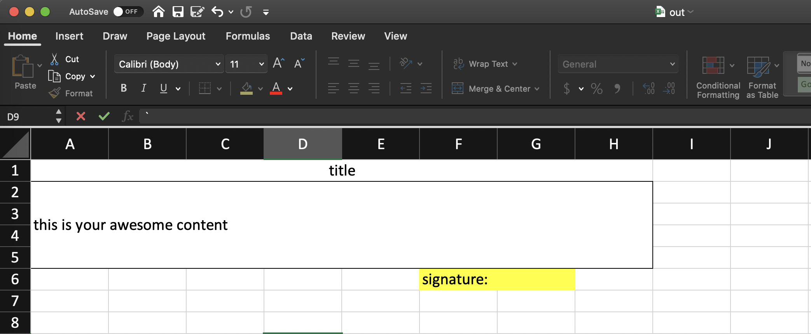
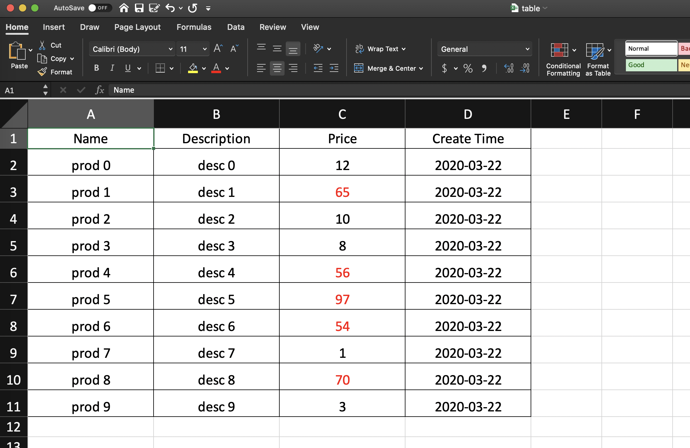

## A Basic Example

Write *title*, a *paragraph* and a *signature row*.

```python
from poi import Sheet, Row, Cell

sheet = Sheet(
    root=
    [
        Row(
            children=[
                Cell(
                    "title",
                    grow=True,
                    align="center",
                )
            ]
        ),
        Row(
            children=[
                Cell(
                    "this is your awesome content",
                    grow=True,
                    border=1,
                    valign="vcenter",
                    rowspan=4,
                    height=100,
                )
            ]
        ),
        Row(colspan=8, children=[
            Cell("signature:", offset=5, grow=True,  bg_color='yellow'),
            Cell("")
        ],
            )
    ],
)
sheet.write('out.xlsx')

```




## Export A Data Table

```python
from typing import NamedTuple
from datetime import datetime
import random

from poi import Sheet, Table


class Product(NamedTuple):
    name: str
    desc: str
    price: int
    created_at: datetime


data = [
    Product(name=f"prod {i}", desc=f"desc {i}", price=random.randint(1, 100), created_at=datetime.now())
    for i in range(10)
]
columns = [("name", "Name"), ("desc", "Description"), ("price", "Price"), ("created_at", "Create Time")]
sheet = Sheet(
    root=Table(
        data=data,
        columns=columns,
        cell_width=20,
        cell_style={
            "color: red": lambda record, col: col.attr == "price"
                                              and record.price > 50
        },
        date_format="yyyy-mm-dd",
        align="center",
        border=1,
    )
)
sheet.write('table.xlsx')

```




## Use with your favorite Web Framework

You can integrate Poi with any web framework easily.

### Flask


```python
from flask import send_file

def export(sheet, filename):
    return send_file(
        sheet.to_bytes_io(),
        attachment_filename=filename,
        mimetype="application/vnd.openxmlformats-officedocument.spreadsheetml.sheet",
    )
```


### Django

```python
from django.http import HttpResponse

def export(sheet, filename):
    response = HttpResponse(
        sheet.to_bytes_io().read(),
        content_type="application/vnd.openxmlformats-officedocument.spreadsheetml.sheet",
    )
    response["Content-Disposition"] = f"attachment; filename={filename}"
    return response

```
