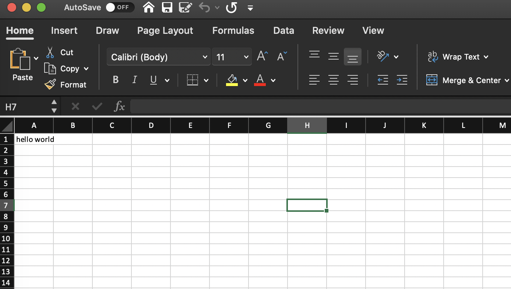

# Introduction

**Poi** is a Python Package for writing data to *xlsx* files.
It allows you to declaratively specify the Shape of your data, and Poi will manage how to write it to the corresponding *Cell* for you automatically. Poi is on top of the *xlsxwriter* library.


## System requirements

Poi requires Python 3.7+. 


## Installation

```bash
pip install poi
```

## Philosophy

Manually writing excel file using library like *xlsxwriter* has long been a pain point for application developers, you have to specify what to write in each *cell* and *row*, how to *merge cells*, the style of each cell, .etc. Leading to code like this:

```python
# Iterate over the data and write it out row by row.
for item, cost in (expenses):
    worksheet.write(row, col,     item)
    worksheet.write(row, col + 1, cost)
    row += 1

# Write a total using a formula.
worksheet.write(row, 0, 'Total')
worksheet.write(row, 1, '=SUM(B1:B4)')

merge_format = workbook.add_format({
    'bold':     True,
    'border':   6,
    'align':    'center',
    'valign':   'vcenter',
    'fg_color': '#D7E4BC',
})
worksheet.merge_range(2, 1, 3, 3, 'Merged Cells', merge_format)
```

I think its too low level for application developers who just want to export some data to excel file. And maintaining *imperative* code like this is error prone and so hard that we may want a better way to deal with exporting data to excel. Why not just write a **Schema** of what we want to export and there's some tool to turn it to a valid xlsx file? Hopefully, this is just what Poi does.

## Quick Start


A *Hello World* example.


What we need is just a `Sheet` object.


```python
from poi import Sheet, Cell
sheet = Sheet(
    root=Cell("hello world")
)

sheet.write('hello.xlsx')
```

Then an *xlsx* file has been created.




What happened? We've created a `Sheet` object with a single `Cell` Node, which just contains the text *hello world*, and then we call `sheet.write` to write the sheet object to the *hello.xlsx* file. 

See, that's pretty simple. Of course, Poi's capabilities go far beyond this. Check out our comprehensive guides to learn more:

- **[Basic Usage](basic-usage.md)**: Learn basic dynamic layouts and how to export simple data tables.
- **[Components Reference](components.md)**: Learn the layout model (`Row`, `Col` containers) and explore all standard components including the automatic column width auto-fit.
- **[Styling & Comments](styling.md)**: Learn standard Excel styling, borders, conditional formatting, and interactive cell/header annotations.
- **[Multi-sheet Workbooks](multi-sheet.md)**: Group multiple worksheets together in a single file using the `Book` API.
- **[Advanced Features](advanced.md)**: Harness optional chaining, dynamic sizing with the `grow` property, and performance optimizations.


